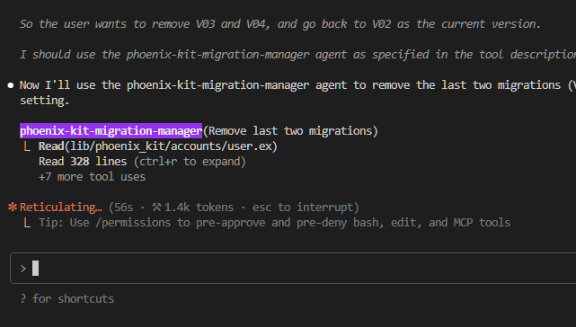

# PhoenixKit

> Professional authentication library for Phoenix applications with zero-config setup

<!-- [](https://hex.pm/packages/phoenix_kit)
[](https://hexdocs.pm/phoenix_kit)
[](https://github.com/BeamLabEU/phoenixkit/blob/main/LICENSE) -->

## Overview

PhoenixKit is a production-ready authentication library for Phoenix applications, built with Oban-style architecture for seamless integration. It provides complete user authentication with registration, login, email confirmation, password reset, and session management.

### Key Features

- 🚀 **Zero-Config Setup** - Automatic repository detection and configuration
- 🗄️ **Professional Database Management** - Versioned migrations with Oban-style architecture
- 🔐 **Complete Authentication** - Registration, login, logout, email confirmation, password reset
- 🎯 **Library-First Design** - No OTP application, integrates into any Phoenix app
- 📦 **Production Ready** - Comprehensive error handling and logging
- 🛠️ **Developer Friendly** - Single command installation with automatic setup
- 🎨 **LiveView Ready** - All authentication pages use Phoenix LiveView

## Installation

PhoenixKit provides multiple installation methods to suit different project needs and developer preferences.

### Semi-Automatic Installation

**Recommended for most projects**

Add both `phoenix_kit` and `igniter` to your project dependencies:

```elixir
# mix.exs
def deps do
  [
    {:phoenix_kit, git: "https://github.com/BeamLabEU/phoenixkit.git"},
    {:igniter, "~> 0.6.0", only: [:dev]}
  ]
end
```

Then run the PhoenixKit installer:

```bash
mix deps.get
mix phoenix_kit.install
```

This will automatically:

- ✅ Auto-detect your Ecto repository
- ✅ **Validate PostgreSQL compatibility** with adapter detection
- ✅ Generate migration files for authentication tables  
- ✅ **Optionally run migrations interactively** for instant setup
- ✅ Add PhoenixKit configuration to `config/config.exs`
- ✅ Configure mailer settings for development
- ✅ **Create production mailer templates** in `config/prod.exs`
- ✅ Add authentication routes to your router
- ✅ Provide detailed setup instructions

**Optional parameters:**

```bash
# Specify custom repository
mix phoenix_kit.install --repo MyApp.Repo

# Use PostgreSQL schema prefix for table isolation
mix phoenix_kit.install --prefix "auth" --create-schema

# Specify custom router file path
mix phoenix_kit.install --router-path lib/my_app_web/router.ex
```

### Igniter Installation

**Single command installation**

For the simplest possible setup, use PhoenixKit's installer:

```bash
mix phoenix_kit.install
```

Optional repository specification:

```bash
mix phoenix_kit.install --repo MyApp.Repo
```

### Manual Installation

**For maximum control**

1. **Add dependency:**

```elixir
# mix.exs
def deps do
  [
    {:phoenix_kit, git: "https://github.com/BeamLabEU/phoenixkit.git"}
  ]
end
```

2. **Install dependency:**

```bash
mix deps.get
```

3. **Generate migration:**

```bash
mix phoenix_kit.gen.migration add_phoenix_kit_auth_tables
```

4. **Configure PhoenixKit:**

```elixir
# config/config.exs
config :phoenix_kit,
  repo: MyApp.Repo

# Required: Configure mailer for email delivery
config :phoenix_kit, PhoenixKit.Mailer,
  adapter: Swoosh.Adapters.Local  # Development
```

5. **Add routes to your router:**

```elixir
# lib/your_app_web/router.ex
defmodule YourAppWeb.Router do
  use YourAppWeb, :router
  import PhoenixKitWeb.Integration

  # Your existing pipelines...

  # Add PhoenixKit authentication routes
  phoenix_kit_routes()  # Available at /phoenix_kit/*
end
```

6. **Run migration:**

```bash
mix ecto.migrate
```

## Quick Verification

After installation, start your Phoenix server:

```bash
mix phx.server
```

Visit these URLs to verify PhoenixKit is working:

- `http://localhost:4000/phoenix_kit/register` - User registration
- `http://localhost:4000/phoenix_kit/login` - User login

## Production Setup

For production environments, configure a proper email adapter:

```elixir
# config/prod.exs
config :phoenix_kit, PhoenixKit.Mailer,
  adapter: Swoosh.Adapters.SMTP,
  relay: "smtp.your-provider.com",
  username: System.get_env("SMTP_USERNAME"),
  password: System.get_env("SMTP_PASSWORD"),
  port: 587,
  tls: :always,
  auth: :always
```

## Advanced Configuration

### Custom URL Prefix

You can customize the URL prefix for PhoenixKit routes:

```elixir
# lib/your_app_web/router.ex
defmodule YourAppWeb.Router do
  use YourAppWeb, :router
  import PhoenixKitWeb.Integration

  # Custom prefix examples
  phoenix_kit_routes("/authentication")  # Available at /authentication/*
  phoenix_kit_routes("/users")          # Available at /users/*
end
```

**⚠️ Note:** We don't recommend using `/auth` as the prefix to avoid conflicts with common authentication patterns.

### PostgreSQL Schema Isolation

For better table organization, you can use PostgreSQL schemas:

```bash
# Install with schema prefix - creates tables in 'auth' schema
mix phoenix_kit.install --prefix "auth" --create-schema
```

This creates tables as:

- `auth.phoenix_kit_users`
- `auth.phoenix_kit_users_tokens`

### Custom Repository

Specify a different Ecto repository:

```bash
# Use custom repository
mix phoenix_kit.install --repo MyApp.CustomRepo
```

### Multiple Ecto Repositories

If you have multiple repos, PhoenixKit will auto-detect the first one, or specify explicitly:

```elixir
# config/config.exs
 # Use specific repo for auth
```

## Configuration

PhoenixKit uses your application's repository:

```elixir
# config/config.exs (automatically added by installer)
config :phoenix_kit, repo: YourApp.Repo
```

### Advanced Configuration

```elixir
config :phoenix_kit,
  repo: YourApp.Repo,
  # Optional: Custom mailer for sending emails
  mailer: YourApp.Mailer

# Layout Integration - Use your app's layouts instead of PhoenixKit's
config :phoenix_kit,
  layout: {YourAppWeb.Layouts, :app},        # Use your app's main layout
  root_layout: {YourAppWeb.Layouts, :root},  # Optional: custom root layout
  page_title_prefix: "Auth"                  # Optional: prefix for page titles

# Layout examples:
# Minimal - only app layout:
# config :phoenix_kit, layout: {YourAppWeb.Layouts, :app}
#
# Complete integration with your app's design:
# config :phoenix_kit,
#   layout: {YourAppWeb.Layouts, :app},
#   root_layout: {YourAppWeb.Layouts, :root},
#   page_title_prefix: "Authentication"

### ⚠️ Important: Recompilation Required

When you modify layout configuration, you **must** recompile PhoenixKit:

```bash
mix deps.compile phoenix_kit --force
```

**Why?** Elixir configuration is compiled at build-time. Changes to `config/config.exs` won't take effect until PhoenixKit is recompiled.

**When to recompile:**
- After adding layout configuration
- After changing `layout` or `root_layout` values  
- After modifying `page_title_prefix`
- When layout integration stops working after config changes

## Phoenix 1.8+ Compatibility

PhoenixKit is fully compatible with Phoenix 1.8+ and supports both layout integration approaches:

### Current Implementation (Works with all Phoenix versions)
- ✅ **Automatic layout detection** - PhoenixKit.LayoutConfig detects your layouts at runtime
- ✅ **Function component integration** - Works seamlessly with Phoenix 1.8 `<Layouts.app>` components
- ✅ **Fallback system** - Uses PhoenixKit defaults if parent layouts aren't configured
- ✅ **Runtime validation** - Validates parent layout modules with helpful warnings

### Phoenix 1.8 Features Supported
- 🚀 **Function Components** - All LiveView templates use `<Layouts.app flash={@flash}>` pattern
- 🔧 **Component Integration** - Supports modern Phoenix component architecture
- 📱 **Responsive Design** - Works with Phoenix 1.8's updated layout system
- 🎨 **Flash Messages** - Integrates with Phoenix 1.8's flash component system

### Layout Integration Process

When you configure layout integration, PhoenixKit automatically:

1. **Detects Parent Layouts** - Validates your app's layout modules exist
2. **Applies Configuration** - Uses your layouts for all PhoenixKit pages
3. **Handles Flash Messages** - Integrates flash messages through your layout
4. **Provides Fallbacks** - Uses PhoenixKit layouts if parent layouts unavailable

### Migration from Phoenix 1.7 to 1.8

If you're upgrading your Phoenix app from 1.7 to 1.8, PhoenixKit will automatically:
- Continue working with existing configuration
- Support new Phoenix 1.8 layout patterns
- Maintain backward compatibility with Phoenix 1.7 layouts

**No changes required** to your PhoenixKit configuration when upgrading Phoenix!
```

## Authentication Routes

PhoenixKit provides these LiveView routes under your chosen prefix:

- `GET /phoenix_kit/register` - User registration form (LiveView)
- `GET /phoenix_kit/log_in` - Login form (LiveView)
- `POST /phoenix_kit/log_in` - User login
- `DELETE /phoenix_kit/log_out` - User logout
- `GET /phoenix_kit/log_out` - User logout (direct URL access)
- `GET /phoenix_kit/reset_password` - Password reset request (LiveView)
- `GET /phoenix_kit/reset_password/:token` - Password reset form (LiveView)
- `GET /phoenix_kit/settings` - User settings (LiveView, requires login)
- `GET /phoenix_kit/settings/confirm_email/:token` - Email confirmation
- `GET /phoenix_kit/confirm/:token` - Account confirmation (LiveView)
- `GET /phoenix_kit/confirm` - Resend confirmation (LiveView)

## Database Schema

PhoenixKit creates these tables:

### `phoenix_kit_users` (Users)

- `id` - Primary key (bigserial)
- `email` - Email address (citext, unique)
- `hashed_password` - Bcrypt hashed password
- `confirmed_at` - Email confirmation timestamp
- `role` - User role (user, moderator, admin) - *Added in v0.3.x*
- `inserted_at`, `updated_at` - Timestamps

### `phoenix_kit_users_tokens` (Authentication Tokens)

- `id` - Primary key (bigserial)
- `user_id` - Foreign key to phoenix_kit_users
- `token` - Secure token (bytea)
- `context` - Token type (session, email, reset)
- `sent_to` - Email address for email tokens
- `inserted_at` - Creation timestamp

### `phoenix_kit_schema_versions` (Migration Tracking)

- Professional versioning system tracks schema changes
- Enables safe upgrades and rollbacks
- Current version: 1.0.0

## Requirements & Configuration

### Database Requirements

PhoenixKit requires **PostgreSQL** as the database adapter:

```elixir
# config/config.exs (your repository configuration)
config :your_app, YourApp.Repo,
  adapter: Ecto.Adapters.Postgres,  # Required
  # ... your database settings
```

**Supported databases:**
- ✅ PostgreSQL (required)
- ❌ MySQL, SQLite, other databases not supported

If you're using a different database, PhoenixKit migration will fail with clear error messages.

### Email Configuration

PhoenixKit requires email configuration for user registration and password reset:

#### Development Setup (Automatic)
```elixir
# config/dev.exs (automatically added by installer)
config :phoenix_kit, PhoenixKit.Mailer,
  adapter: Swoosh.Adapters.Local  # Emails shown at /dev/mailbox
```

#### Production Setup (Automatic Templates)
The installer automatically creates production mailer templates in `config/prod.exs` as comments. Simply uncomment and configure your preferred adapter:

```elixir
# Example: SMTP Configuration
config :phoenix_kit, PhoenixKit.Mailer,
  adapter: Swoosh.Adapters.SMTP,
  relay: "smtp.gmail.com",
  username: System.get_env("SMTP_USERNAME"),
  password: System.get_env("SMTP_PASSWORD"),
  port: 587,
  auth: :always,
  tls: :always

# Example: SendGrid
config :phoenix_kit, PhoenixKit.Mailer,
  adapter: Swoosh.Adapters.Sendgrid,
  api_key: System.get_env("SENDGRID_API_KEY")

# Example: Mailgun  
config :phoenix_kit, PhoenixKit.Mailer,
  adapter: Swoosh.Adapters.Mailgun,
  api_key: System.get_env("MAILGUN_API_KEY"),
  domain: System.get_env("MAILGUN_DOMAIN")
```

💡 **Auto-Generated**: These examples are automatically added to your `config/prod.exs` during installation.

**⚠️ Important**: Without proper mailer configuration, user registration and password reset will fail.

## API Usage

### Getting Current User

```elixir
# In your controller or LiveView
phoenix_kit_current_user = conn.assigns[:phoenix_kit_current_user]
```

### User Operations

```elixir
# Get user by email
user = PhoenixKit.Users.Auth.get_user_by_email("user@example.com")

# Register new user
{:ok, user} = PhoenixKit.Users.Auth.register_user(%{
  email: "user@example.com",
  password: "secure_password"
})

# Authenticate user
{:ok, user} = PhoenixKit.Users.Auth.get_user_by_email_and_password(
  "user@example.com",
  "password"
)
```

### Authentication Helpers

```elixir
# In your controllers
import PhoenixKitWeb.Users.Auth

# Require authentication
plug :phoenix_kit_require_authenticated_user

# Redirect if already logged in
plug :phoenix_kit_redirect_if_user_is_authenticated
```

## PhoenixKit Scope System

PhoenixKit v0.1.14+ introduces an advanced **Scope System** for better authentication state management in your application layouts and LiveViews. This system provides structured access to authentication data with improved encapsulation and type safety.

### What is the Scope System?

The Scope system encapsulates user authentication state in a structured way, providing:

- **Better Encapsulation**: Authentication state wrapped in a dedicated struct
- **Type Safety**: Explicit functions for checking authentication status
- **Future-Ready**: Prepared for extensions like roles and permissions
- **Backward Compatibility**: Works alongside existing `phoenix_kit_current_user`

### Basic Usage

Add PhoenixKit scope to your LiveView sessions:

```elixir
# lib/your_app_web/router.ex
defmodule YourAppWeb.Router do
  use YourAppWeb, :router
  import PhoenixKitWeb.Integration

  # Your existing pipelines...

  # Add PhoenixKit authentication routes
  phoenix_kit_routes()

  # Your app routes with scope integration
  scope "/", YourAppWeb do
    pipe_through :browser

    # Public routes with optional authentication info
    live_session :public,
      layout: {YourAppWeb.Layouts, :app},
      on_mount: [{PhoenixKitWeb.Users.Auth, :phoenix_kit_mount_current_scope}] do
      live "/", PageLive
      live "/about", AboutLive
    end

    # Protected routes requiring authentication
    live_session :authenticated,
      layout: {YourAppWeb.Layouts, :app},
      on_mount: [{PhoenixKitWeb.Users.Auth, :phoenix_kit_ensure_authenticated_scope}] do
      live "/dashboard", DashboardLive
      live "/profile", ProfileLive
    end
  end
end
```

### Using Scope in Layouts

Access authentication data in your layout templates:

```heex
<!-- lib/your_app_web/components/layouts/app.html.heex -->
<header>
  <div class="user-info">
    <%= if PhoenixKit.Users.Auth.Scope.authenticated?(@phoenix_kit_current_scope) do %>
      <div class="user-menu">
        Welcome, {PhoenixKit.Users.Auth.Scope.user_email(@phoenix_kit_current_scope)}!
        <.link href="/phoenix_kit/settings">Settings</.link>
        <.link href="/phoenix_kit/log_out" method="delete">Logout</.link>
      </div>
    <% else %>
      <div class="auth-links">
        <.link href="/phoenix_kit/log_in">Login</.link>
        <.link href="/phoenix_kit/register">Sign Up</.link>
      </div>
    <% end %>
  </div>
</header>
```

### Available Scope Functions

```elixir
# Check if user is authenticated
PhoenixKit.Users.Auth.Scope.authenticated?(@phoenix_kit_current_scope)
# => true | false

# Check if user is anonymous (not authenticated)
PhoenixKit.Users.Auth.Scope.anonymous?(@phoenix_kit_current_scope)
# => true | false

# Get user email (safe - returns nil if not authenticated)
PhoenixKit.Users.Auth.Scope.user_email(@phoenix_kit_current_scope)
# => "user@example.com" | nil

# Get user ID (safe - returns nil if not authenticated)
PhoenixKit.Users.Auth.Scope.user_id(@phoenix_kit_current_scope)
# => 123 | nil

# Get user struct (for advanced usage)
PhoenixKit.Users.Auth.Scope.user(@phoenix_kit_current_scope)
# => %PhoenixKit.Users.Auth.User{} | nil
```

### Available on_mount Callbacks

PhoenixKit provides multiple authentication levels:

#### Scope-Based Callbacks (Recommended for New Projects)

```elixir
# Mount scope - always accessible, provides authentication context
on_mount: [{PhoenixKitWeb.Users.Auth, :phoenix_kit_mount_current_scope}]

# Require authentication via scope - redirects to login if not authenticated
on_mount: [{PhoenixKitWeb.Users.Auth, :phoenix_kit_ensure_authenticated_scope}]

# Redirect if authenticated - useful for login/register pages
on_mount: [{PhoenixKitWeb.Users.Auth, :phoenix_kit_redirect_if_authenticated_scope}]
```

#### Traditional User-Based Callbacks (Backward Compatibility)

```elixir
# Mount user - provides @phoenix_kit_current_user
on_mount: [{PhoenixKitWeb.Users.Auth, :phoenix_kit_mount_current_user}]

# Require authentication - redirects if not authenticated
on_mount: [{PhoenixKitWeb.Users.Auth, :phoenix_kit_ensure_authenticated}]

# Redirect if authenticated
on_mount: [{PhoenixKitWeb.Users.Auth, :phoenix_kit_redirect_if_user_is_authenticated}]
```

### Migration from Traditional Approach

If you're already using `@phoenix_kit_current_user`, you can gradually migrate:

#### Step 1: Current Implementation
```elixir
# Your current working setup
live_session :default,
  layout: {YourAppWeb.Layouts, :app},
  on_mount: [{PhoenixKitWeb.Users.Auth, :phoenix_kit_mount_current_user}] do
  # ... your routes
end
```

#### Step 2: Upgrade to Scope (Backward Compatible)
```elixir
# Upgrade to scope - adds both user and scope assigns
live_session :default,
  layout: {YourAppWeb.Layouts, :app},
  on_mount: [{PhoenixKitWeb.Users.Auth, :phoenix_kit_mount_current_scope}] do
  # ... same routes, now you have access to both:
  # @phoenix_kit_current_user (continues working)
  # @phoenix_kit_current_scope (new, better structure)
end
```

#### Step 3: Update Layout Templates
```heex
<!-- Traditional approach (continues to work) -->
<%= if @phoenix_kit_current_user do %>
  <span>Welcome, {@phoenix_kit_current_user.email}!</span>
<% end %>

<!-- New scope approach (better structure) -->
<%= if PhoenixKit.Users.Auth.Scope.authenticated?(@phoenix_kit_current_scope) do %>
  <span>Welcome, {PhoenixKit.Users.Auth.Scope.user_email(@phoenix_kit_current_scope)}!</span>
<% end %>
```

### Benefits of Scope System

#### Traditional User Access
```elixir
# Direct user access - less structured
<%= if @phoenix_kit_current_user do %>
  <p>User: {@phoenix_kit_current_user.email}</p>
<% end %>
```

#### Scope-Based Access (Recommended)
```elixir
# Structured access with explicit authentication checking
<%= if PhoenixKit.Users.Auth.Scope.authenticated?(@phoenix_kit_current_scope) do %>
  <p>User: {PhoenixKit.Users.Auth.Scope.user_email(@phoenix_kit_current_scope)}</p>
<% end %>
```

**Advantages:**
- **Explicit Authentication State**: Clear `authenticated?/1` function
- **Safe Property Access**: Functions return `nil` for unauthenticated users
- **Better Encapsulation**: Authentication logic contained in dedicated module
- **Future Extensions**: Ready for roles, permissions, and additional context
- **Type Safety**: Proper struct with documented functions

### When to Use Which Approach

**Use `@phoenix_kit_current_user` when:**
- Migrating from existing Phoenix auth patterns
- You need simple, direct access to user properties
- Your app has basic authentication requirements

**Use `@phoenix_kit_current_scope` when:**
- Building new applications from scratch
- You want better code structure and type safety
- You plan to add roles or permissions later
- You prefer explicit authentication state checking

### Complete Router Example

```elixir
defmodule YourAppWeb.Router do
  use YourAppWeb, :router
  import PhoenixKitWeb.Integration

  pipeline :browser do
    plug :accepts, ["html"]
    plug :fetch_session
    plug :fetch_live_flash
    plug :put_root_layout, html: {YourAppWeb.Layouts, :root}
    plug :protect_from_forgery
    plug :put_secure_browser_headers
  end

  # Add PhoenixKit authentication routes
  phoenix_kit_routes()

  scope "/", YourAppWeb do
    pipe_through :browser

    # Public routes with authentication context
    live_session :public,
      layout: {YourAppWeb.Layouts, :app},
      on_mount: [{PhoenixKitWeb.Users.Auth, :phoenix_kit_mount_current_scope}] do
      live "/", PageLive
      live "/about", AboutLive
      live "/pricing", PricingLive
    end

    # Protected routes
    live_session :authenticated,
      layout: {YourAppWeb.Layouts, :app},
      on_mount: [{PhoenixKitWeb.Users.Auth, :phoenix_kit_ensure_authenticated_scope}] do
      live "/dashboard", DashboardLive
      live "/profile", ProfileLive
    end

    # Routes that redirect authenticated users away
    live_session :redirect_if_authenticated,
      layout: {YourAppWeb.Layouts, :app},
      on_mount: [{PhoenixKitWeb.Users.Auth, :phoenix_kit_redirect_if_authenticated_scope}] do
      live "/welcome", WelcomeLive
    end
  end
end
```

This gives you a complete authentication system with structured access to user data in your layouts and LiveViews.

## Architecture

PhoenixKit follows Oban's architecture principles:

- **Library-First**: No OTP application, minimal dependencies
- **Dynamic Repository**: Uses your app's Ecto repo automatically
- **Versioned Migrations**: Professional schema management with rollback support
- **Zero Dependencies**: Works with any Phoenix application
- **Production Ready**: Comprehensive error handling and logging
- **LiveView Native**: All authentication pages use Phoenix LiveView

## Migration System

PhoenixKit uses a professional versioned migration system:

```bash
# Check migration status and version information
mix phoenix_kit.migrate --status
```

```elixir
# Automatic version tracking
PhoenixKit.SchemaMigrations.get_installed_version(repo)
# => "1.0.0"

# Check if migration needed
PhoenixKit.SchemaMigrations.migration_required?(repo)
# => false

# Migrate to current version
PhoenixKit.SchemaMigrations.migrate_to_current(repo)
# => :ok
```

## Customization

### Custom Views and Templates

Override PhoenixKit templates by creating files in your app:

```
lib/your_app_web/templates/phoenix_kit_web/
├── user_registration/
│   └── new.html.heex
├── user_session/
│   └── new.html.heex
└── layouts/
    └── phoenix_kit.html.heex
```

### Theme System

PhoenixKit includes a comprehensive theme system with light/dark mode support, automatic system preference detection, and DaisyUI integration.

#### Quick Start

Enable the theme system in your configuration:

```elixir
# config/config.exs
config :phoenix_kit, theme_enabled: true
```

Add theme assets to your layout:

```html
<!-- In your app.html.heex or root.html.heex -->
<link rel="stylesheet" href={~p"/assets/phoenix_kit_theme.css"} />
<script defer src={~p"/assets/phoenix_kit_theme.js"}></script>
```

Add the theme switcher to your navigation:

```heex
<!-- Minimal theme switcher -->
<.theme_switcher />

<!-- Theme switcher with label -->
<.theme_switcher show_label={true} />

<!-- Custom styled theme switcher -->
<.theme_switcher class="mr-4" size="large" />
```

#### Full Configuration

Configure all theme system options:

```elixir
# config/config.exs
config :phoenix_kit,
  theme_enabled: true,
  theme: %{
    mode: :auto,                    # :light, :dark, :auto
    primary_color: "#3b82f6",      # Primary brand color
    themes: [:light, :dark],        # Available themes
    storage: :local_storage         # :local_storage, :session, :cookie
  }
```

#### Theme Modes

- **Light Mode**: Forces light theme regardless of system preference
- **Dark Mode**: Forces dark theme regardless of system preference  
- **Auto Mode**: Automatically switches based on system preference (`prefers-color-scheme`)

#### DaisyUI Integration

PhoenixKit automatically integrates with DaisyUI themes:

```css
/* Your CSS can use DaisyUI theme variables */
.custom-element {
  background-color: hsl(var(--base-100));
  color: hsl(var(--base-content));
}
```

#### Programmatic Theme Control

Use the JavaScript API for advanced theme management:

```javascript
// Switch to dark mode
window.PhoenixKitTheme.switch('dark');

// Toggle between light and dark
window.PhoenixKitTheme.toggle();

// Get current theme info
const info = window.PhoenixKitTheme.info();
console.log('Current theme:', info.current);
console.log('Effective theme:', info.effective);
```

#### Layout Integration Examples

**Root Layout Integration:**

```heex
<!DOCTYPE html>
<html lang="en" 
      {PhoenixKit.ThemeConfig.theme_data_attributes()}
      data-theme={PhoenixKit.ThemeConfig.daisy_theme_name(PhoenixKit.ThemeConfig.get_theme_mode())}
      style={PhoenixKit.ThemeConfig.theme_css_variables()}>
  <head>
    <!-- Your head content -->
    <link rel="stylesheet" href={~p"/assets/phoenix_kit_theme.css"} />
  </head>
  <body>
    <nav class="navbar">
      <div class="navbar-end">
        <.theme_switcher size="small" />
      </div>
    </nav>
    
    <main>{@inner_content}</main>
    
    <script defer src={~p"/assets/phoenix_kit_theme.js"}></script>
  </body>
</html>
```

#### Installation Integration

The theme system is automatically configured during PhoenixKit installation:

```bash
mix phoenix_kit.install --theme-enabled
```

This will:
- ✅ Enable theme configuration in config.exs
- ✅ Copy theme assets to your project
- ✅ Update layout files with theme integration
- ✅ Add theme switcher to navigation

## Troubleshooting

### Common Issues

**No repository configured**

```
ERROR: No repository configured for PhoenixKit
```

Solution: Run `mix phoenix_kit.install --repo MyApp.Repo` or manually add config.

**--repo parameter required**

```
ERROR: --repo is required!
```

Solution: Always specify `--repo` parameter: `mix phoenix_kit.install --repo MyApp.Repo`

**Migration errors**

```
ERROR: Schema migration failed
ERROR: could not find migration runner process
```

Solution: Check database connection and permissions. Auto-setup migration system has been improved in v0.1.7+ to handle runtime migration contexts correctly.

**URL not found**

```
ERROR: No route found for GET /phoenix_kit/register
```

Solution: Import `PhoenixKitWeb.Integration` and add `phoenix_kit_routes()`.

### Debug Logging

Enable debug logging to troubleshoot setup:

```elixir
# config/dev.exs
config :logger, level: :debug
```

## Contributing

1. Fork the repository
2. Create a feature branch
3. Make your changes
4. Add tests: `mix test`
5. Run quality checks: `mix quality`
6. Submit a pull request

## Upgrade Guide

### From 0.1.x to 0.2.x

PhoenixKit will automatically detect and run schema migrations. No manual intervention required.

**Important:** Table names have been updated from `phoenix_kit`/`phoenix_kit_tokens` to `phoenix_kit_users`/`phoenix_kit_users_tokens`. Fresh installations will use the new names automatically.

### From 0.2.x to 0.3.x - User Role System

PhoenixKit v0.3.x introduces a user role system with support for `user`, `moderator`, and `admin` roles.

#### What's New in v0.3.x:

- 🔐 **User Roles**: Built-in support for user, moderator, and admin roles
- 📊 **Role-based Authorization**: Helper functions for permission checking
- 🛡️ **Backward Compatibility**: Existing users automatically get `user` role
- 🚀 **Simple Integration**: Works with existing Phoenix plug-based authorization

#### Upgrading to v0.3.x:

**Step 1: Update PhoenixKit**

```bash
# Update your dependency
mix deps.update phoenix_kit
```

**Step 2: Run Database Migration**

```bash
# Migrate to v0.3.x with role support
mix phoenix_kit.migrate --version 3

# Or check current version first
mix phoenix_kit.migrate --status
```

**Step 3: Optional - Use Role-based Authorization**

Add role-based authorization to your application:

```elixir
# lib/your_app_web/user_auth.ex
defmodule YourAppWeb.UserAuth do
  # ... existing functions ...

  # Simple role-based authorization
  def require_role(conn, required_role) do
    user = conn.assigns.phoenix_kit_current_user
    
    if user && PhoenixKit.Users.Auth.User.has_role_level?(user, required_role) do
      conn
    else
      conn
      |> Phoenix.Controller.put_flash(:error, "Access denied")
      |> Phoenix.Controller.redirect(to: "/")
      |> Plug.Conn.halt()
    end
  end

  # Admin only access
  def require_admin(conn, _opts) do
    require_role(conn, :admin)
  end

  # Moderator or admin access  
  def require_moderator(conn, _opts) do
    require_role(conn, :moderator)
  end
end
```

**Step 4: Use in Router**

```elixir
# lib/your_app_web/router.ex
defmodule YourAppWeb.Router do
  # ... existing pipelines ...
  
  # Admin-only routes
  scope "/admin" do
    pipe_through [:browser, :require_authenticated_user, :require_admin]
    
    get "/users", AdminController, :users
    get "/settings", AdminController, :settings
  end

  # Moderator routes  
  scope "/moderate" do
    pipe_through [:browser, :require_authenticated_user, :require_moderator]
    
    get "/posts", ModerationController, :posts
  end
end
```

#### New Role Helper Functions:

```elixir
user = PhoenixKit.Users.Auth.get_user_by_email("user@example.com")

# Check specific roles
PhoenixKit.Users.Auth.User.admin?(user)        # true/false
PhoenixKit.Users.Auth.User.moderator?(user)    # true/false  
PhoenixKit.Users.Auth.User.can_moderate?(user) # true for moderator or admin

# Check minimum role level
PhoenixKit.Users.Auth.User.has_role_level?(user, :moderator)
```

#### Database Schema Changes:

The migration adds a new `role` column to `phoenix_kit_users`:

- **Column**: `role VARCHAR(20) DEFAULT 'user' NOT NULL`
- **Index**: `phoenix_kit_users_role_index` for fast role-based queries
- **Constraint**: Validates role values (`user`, `moderator`, `admin`)
- **Backward Compatibility**: Existing users automatically get `user` role

#### Rollback Support:

If you need to rollback the role system:

```bash
# Rollback to v0.2.x (removes role column)
mix phoenix_kit.migrate --version 2
```

**Note**: Rolling back will remove all role information from the database.

## License

This project is licensed under the MIT License.

## Changelog

See [CHANGELOG.md](CHANGELOG.md) for version history and changes.

---

Built with ❤️ for the Phoenix community
